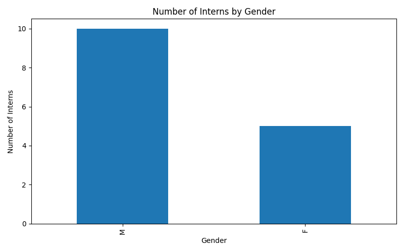
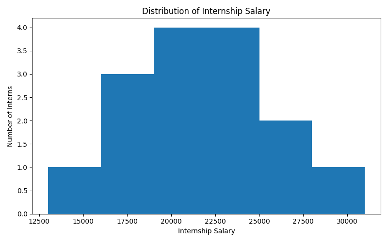
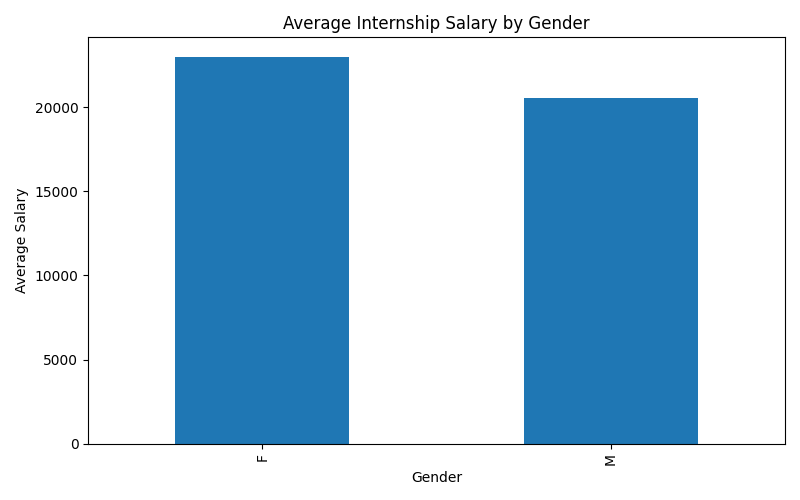
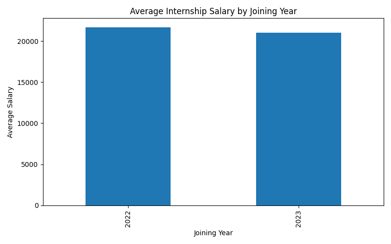
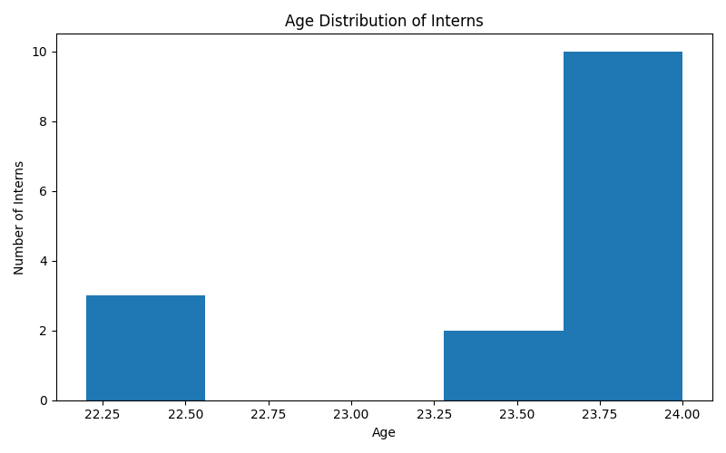
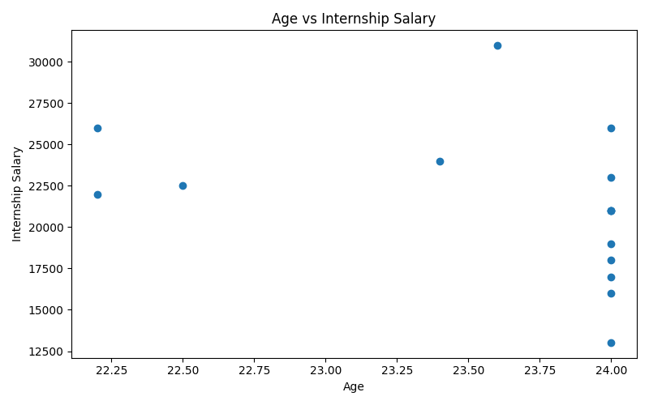
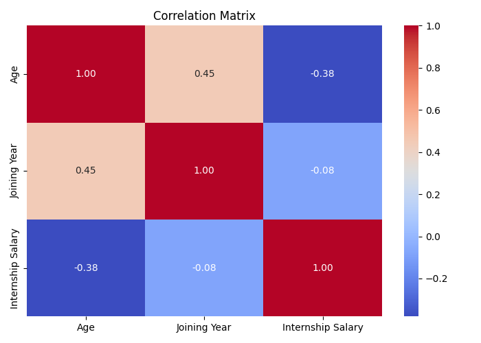
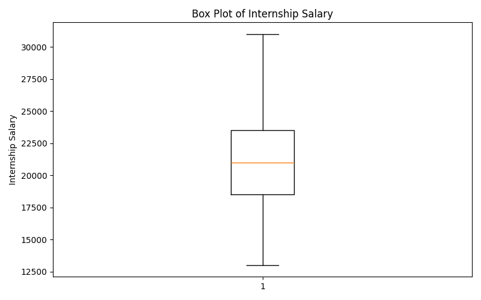
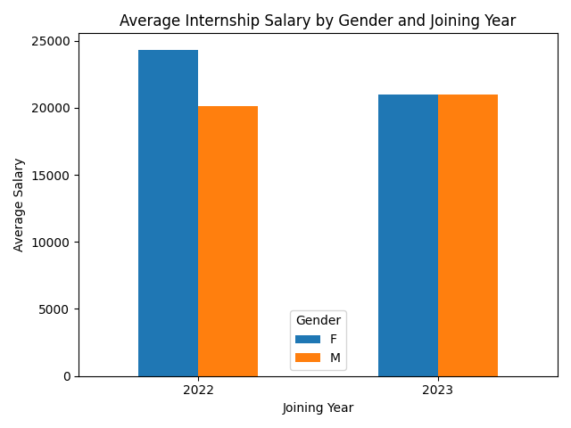
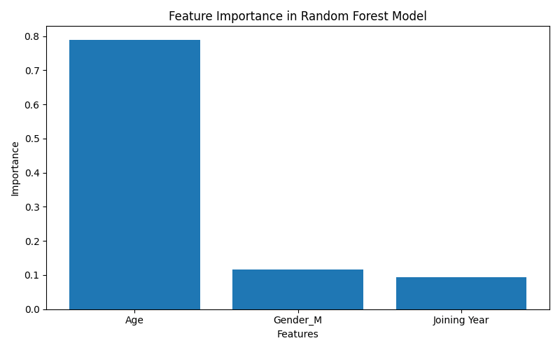

# Internship Salary Analysis and Workforce Insights

## 📌 Project Overview

This project analyzes internship salary data using Python and data analytics techniques. The objective is to understand salary patterns and explore relationships between internship salary, age, gender, and joining year.

The project also applies machine learning models to explore whether the available features can be used to predict internship salary.

## 🎯 Objectives

- Clean and preprocess the internship dataset
- Perform exploratory data analysis (EDA)
- Analyze internship salary distributions
- Compare salary patterns across gender and joining year
- Study the relationship between age and internship salary
- Build machine learning models for salary prediction
- Compare Linear Regression and Random Forest Regression
- Identify important features influencing model predictions
- Generate meaningful insights and recommendations

## 📊 Dataset

The dataset contains information about 15 interns.

### Features

| Feature | Description |
|---|---|
| Age | Age of the intern |
| Gender | Gender of the intern |
| Internship Salary | Monthly internship salary |
| Joining Year | Year in which the intern joined |

The dataset uploaded to this repository has been anonymized to avoid exposing personal information.

## 🛠️ Technologies Used

- Python
- Pandas
- NumPy
- Matplotlib
- Seaborn
- Scikit-learn
- Google Colab
- Jupyter Notebook

## 🔍 Data Analysis

The project includes:

- Data cleaning
- Missing-value analysis
- Duplicate-value analysis
- Feature creation
- Descriptive statistics
- Gender distribution analysis
- Salary distribution analysis
- Salary analysis by gender
- Salary analysis by joining year
- Age distribution analysis
- Age vs. salary analysis
- Correlation analysis
- Feature importance analysis

## 🤖 Machine Learning

Two regression models were developed:

1. Linear Regression
2. Random Forest Regression

### Model Comparison

| Metric | Linear Regression | Random Forest |
|---|---:|---:|
| MAE | ₹5,747.23 | **₹4,883.83** |
| MSE | 35,240,990.27 | **25,583,557.46** |
| RMSE | ₹5,936.41 | **₹5,058.02** |
| R² Score | -0.192 | **0.134** |

Based on the test results, Random Forest performed better than Linear Regression for this dataset.

## 📈 Key Findings

- The dataset contains 15 interns.
- 10 interns are male and 5 are female.
- The average internship salary is approximately ₹21,366.67.
- The median internship salary is ₹21,000.
- The highest recorded salary is ₹31,000.
- The lowest recorded salary is ₹13,000.
- The average salary for female interns is ₹23,000.
- The average salary for male interns is ₹20,550.
- The age-salary correlation is approximately -0.38.
- Random Forest performed better than Linear Regression on the test set.
- Age was the most important feature in the Random Forest model.

## ⚠️ Limitations

The dataset contains only 15 observations. Therefore, the machine learning results may not generalize to larger populations.

The model results should be considered an academic demonstration rather than a production-level salary prediction system.

## 🚀 Future Improvements

Future versions of this project could:

- Use a larger internship dataset
- Include additional features such as educational qualification, skills, location, internship duration, and department
- Apply cross-validation
- Perform hyperparameter tuning
- Compare additional machine learning algorithms
- Develop an interactive dashboard for salary analysis

## 📊 Visualizations

### Gender Distribution

### Salary Distribution

### Average Salary by Gender

### Average Salary by Joining Year

### Age Distribution

### Age vs Internship Salary

### Correlation Matrix

### Salary Distribution — Box Plot

### Salary by Gender and Joining Year

### Random Forest Feature Importance

## 📁 Repository Contents

- `Internship_Salary_Analysis.ipynb` — Complete Python analysis and machine learning workflow
- `Internship_Salary_Analysis_Data.csv` — Anonymized dataset used for analysis
- `README.md` — Project documentation

## 👩‍💻 Author

**Shalini**
